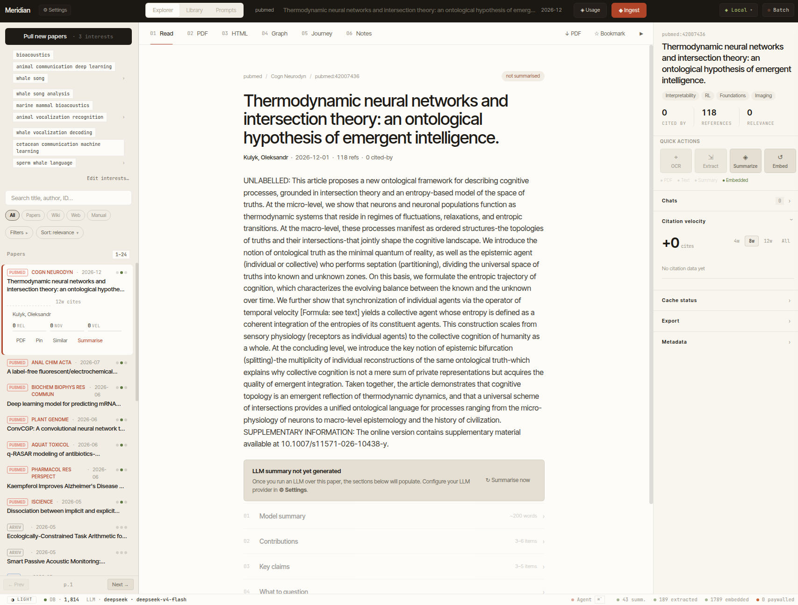
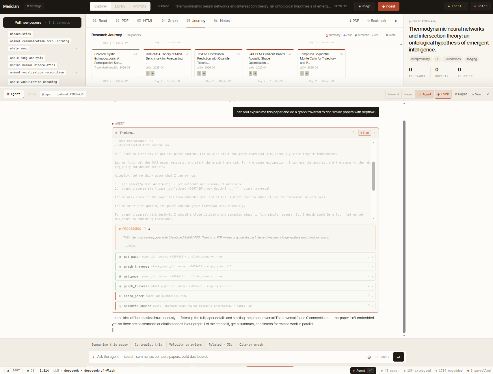
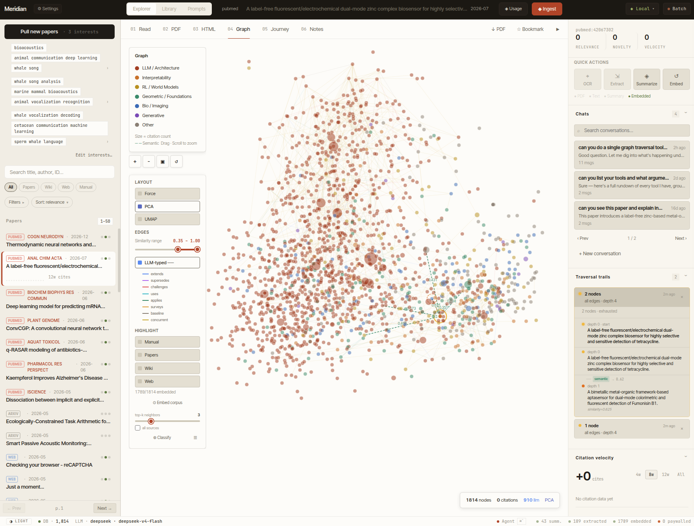

# Meridian — ML Research Station

A local ML paper explorer and research assistant. Ingests papers from arXiv, bioRxiv, OpenReview, Semantic Scholar, Wikipedia, and arbitrary web pages; stores them in SQLite + ChromaDB; exposes everything through a FastAPI backend + React SPA. An agentic chat loop (OpenAI Agents SDK) lets you query the corpus with ~22 tools.



---

## Quick start

```bash
# 1. Install Python deps (uv recommended)
uv pip install -e ".[dev,pdf,embeddings,api,llm,web]"

# 2. Install and build the frontend
make frontend-install && make frontend-build

# 3. Configure secrets
cp .env.example .env
# edit .env — set your API keys and LLM backend

# 4. Start the server (http://localhost:8080)
make serve
```

For frontend hot-reload during development, run `make frontend-dev` in a second terminal (proxies API calls to port 8080).

---

## Configuration

Most settings can be changed directly inside the app via the **⚙ Settings** panel (LLM provider, model, base URL, temperature, OCR backend, embedding model, ingestion preferences, and more). Changes are written back to `.env` immediately — no restart needed.

For first-time setup or secrets, edit `.env` directly. All settings map to `src/research_station/config/settings.py` via Pydantic Settings. Nested keys use `__` as delimiter.

```env
# LLM backend (choose one)
LLM__PROVIDER=anthropic          # anthropic | openai | vllm | ollama
LLM__MODEL_NAME=claude-sonnet-4-6
ANTHROPIC_API_KEY=sk-ant-...

# Local inference (vLLM or Ollama)
LLM__PROVIDER=vllm
LLM__VLLM_BASE_URL=http://localhost:8000/v1

# Embeddings
EMBEDDING__PROVIDER=vllm         # vllm | ollama | sentence_transformers
EMBEDDING__MODEL=Qwen/Qwen3-Embedding-0.6B

# Optional keys (increase rate limits)
SEMANTIC_SCHOLAR_API_KEY=...
OPENREVIEW_USERNAME=...
OPENREVIEW_PASSWORD=...
DEEPSEEK_API_KEY=...
```

---

## Ingestion

```bash
make ingest           # pull from all configured sources
make ingest-arxiv     # arXiv only
make ingest-dry       # dry-run (no writes)
```

Papers can also be added one-at-a-time from the UI (by arXiv ID, PDF upload, or URL).

---

## Development

```bash
make lint             # ruff check + format check
make format           # ruff autofix + format
make typecheck        # mypy (strict)
make test             # pytest (unit, no network)
make test-integration # pytest (hits live APIs)
```

### Pre-commit hooks

```bash
pip install pre-commit
pre-commit install
```

Hooks: **ruff** (lint + format), **detect-secrets** (secret scanning), **bandit** (security audit of `src/`).

---

## Tech stack

| Layer | Technology |
|---|---|
| API | FastAPI + Uvicorn |
| ORM | SQLAlchemy (SQLite, WAL) |
| Vector DB | ChromaDB |
| Agent SDK | openai-agents |
| LLM providers | Anthropic, OpenAI, vLLM, Ollama |
| Embeddings | vLLM / Ollama / sentence-transformers |
| OCR | DeepSeek-VL, Qwen-VL, NanonetsOCR (vision LLMs) |
| Web scraping | Playwright + PIL |
| RAG | BM25 + ChromaDB semantic search |
| Frontend | React 18 + TypeScript, built with Vite |

---

## Directory layout

```
ml_research_station/
├── src/research_station/
│   ├── api/                  # FastAPI app, agent loop, routes
│   ├── config/settings.py    # Pydantic Settings (all config here)
│   ├── database/             # SQLAlchemy engine + repository layer
│   ├── ingestion/            # Fetchers (arXiv, bioRxiv, OpenReview, …)
│   ├── models/               # ORM + domain models
│   ├── processing/           # LLM clients, summarizer, OCR, embeddings
│   └── prompts/              # Agent + skill prompt files (hot-reloaded)
├── frontend/
│   ├── src/components/       # React + TypeScript components
│   ├── src/api.ts            # HTTP/SSE client
│   ├── styles.css            # Design system (CSS custom properties)
│   ├── vite.config.ts
│   └── dist/                 # Built SPA (git-ignored; run make frontend-build)
├── scripts/                  # CLI helpers
├── tests/
├── .env.example
├── pyproject.toml
└── Makefile
```

---

## Agent tools

The chat agent has ~22 tools including: `search_papers`, `semantic_search`, `get_paper`, `summarize_paper`, `ocr_paper`, `rag_query`, `graph_traverse`, `get_entities`, `extract_entities`, `ingest_wikipedia_article`, `ingest_webpage`, `ingest_papers`, `execute_python`, `create_dashboard`, `add_note`, and more.

The agent system prompt and all skill files in `prompts/skills/` are reloaded from disk on every request — edit them without restarting the server.



The citation and semantic graph visualises relationships between papers and highlights traversal paths explored by the agent.



---

## License

MIT
